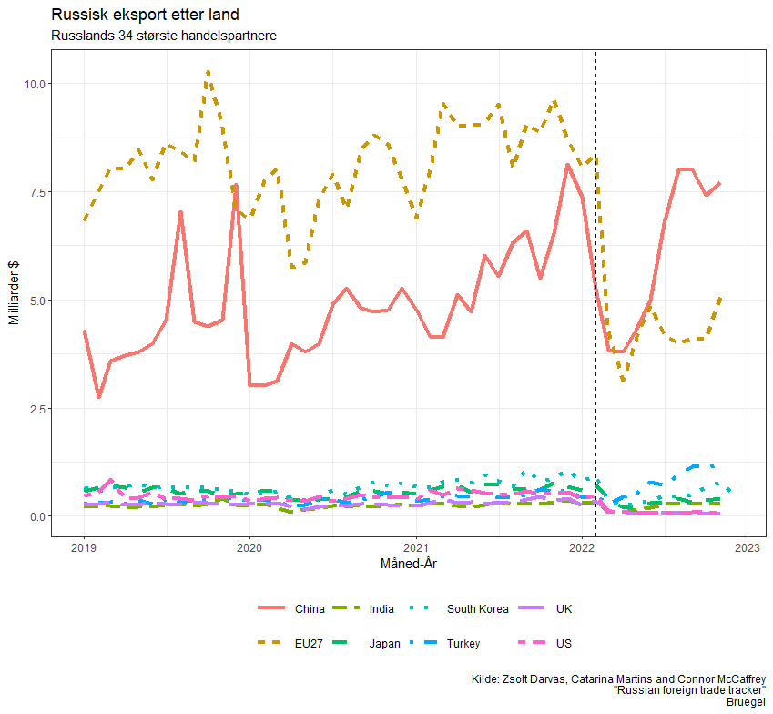
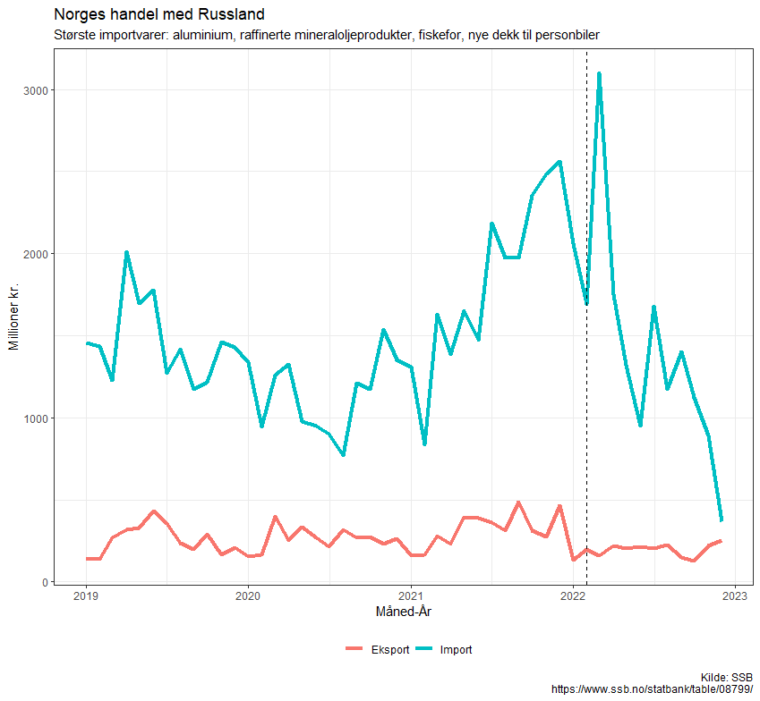

Da russiske styrker strømmet over grensen til Ukraina for ett år siden innførte land i EU, Nord-Amerika, Japan, Sør-Korea og Australia omfattende sanksjoner mot Russland. Disse sanksjonene kom i tillegg til de som begynte i 2014 som svar til Russlands opprinnelige aggresjon i Øst-Ukraina og okkupasjon av Krimhalvøyen. Sanksjonene ble rettet mot høytstående individer i den russiske staten og næringsliv, mot flere (men ikke alle) russiske banker og finansinstitusjoner og mot handel med Russland i strategiske varer, blant annet  varer med militært formål. I tillegg til de offisielle sanksjonene annonserte hundrevis av vestlige selskaper frivillige boikotter av virksomhet i Russland. 

Den mest effektive metoden for å påføre Russland umiddelbar krise hadde vært en brå stopp i kjøp av alle russiske gass og oljeprodukter, men omfattende sanksjoner på russiske fossile brensler ble ikke noe av. Mens land som USA raskt kunne kutte kjøp av russisk olje og gass, trengte de alle fleste landene i Europa tid for overgang til andre energikilder. Dermed ble Russlands største inntektskilde uberørt i krigens første måneder. Istedenfor å slutte å kjøpe fossile brensler fra Russland fortsatte Europa å importere til rekordhøye priser, slik at Russlands eksportinntekter skjøt i været. Resultatet var at Russlands budsjett gikk i pluss. Landets «oljefond» økte. 

Uansett skapte sanksjonene store forventninger. Flere utenlandske analytikere spådde en russisk økonomisk nedgang av 10-20 prosent. Noen ventet en kollaps i russiske finans- og valutamarkeder. 

Det har ikke skjedd. 

Men det er mye som tyder på at sanksjonene rammer Russland hardere enn det ser ut ved første øyekast.

Russiske importører har sakte, men sikkert funnet andre erstatninger for vestlige varer i andre land eller begynt med såkalt «parallell-import» – uoffisiell import av vestlige varer gjennom tredjeland. Det fører stort sett til importvarer av litt lavere kvalitet og til litt høyere pris. 

Ikke alt kan erstattes eller importeres gjennom andre land. Vestlige sanksjoner på varer for militære formål har stanset russisk produksjon av noen våpen, inkludert visse typer stridsvogner, raketter og transportmidler. Som svar på dette blir Russland nødt til å kutte produksjon eller nedgradere våpensystemer som produseres. Sanksjonene på slike varer har dermed påført viktige begrensninger i Russlands militære kapasitet.

Selv om arbeidsledighet er lav, ca. 3,7 prosent, har flere millioner russere blitt permittert, brorparten av dem uten lønn. Derfor estimerer noen analytikere at den ekte arbeidsledigheten er rundt 10 prosent. I tillegg har fra 500.000 til en million russere flyktet til utlandet. De er hovedsakelig unge, godt utdannete menn. Minst 100.000 av dem er IT-spesialister, det reelle tallet kan være mye høyere. De er – eller var – landets fremtid.

I tillegg har statens finanser forverret seg. Statlige utgifter tilknyttet krigen øker. De astronomiske prisene på olje og gass i 2022 har sunket. I tillegg virker det som om EUs «pristak» har en viss effekt, selv om det er for tidlig å si noe om langsiktige resultater. 

Totalt i 2022 havnet det russiske statsbudsjettet i minus med underskudd av 2,3% av BNP. Militærutgiftene utgjør nåomtrent. en tredel av budsjettet og kommer bare til å øke. Russlands finansministerium prognoserer et underskudd på ca. 2 prosent  av BNP i 2023, mens tall fra januar tyder på at tallet vil øke mot 5 prosent. 

Statsministeren Mikhail Misjustin har snakket om behov for «inntektsmobilisering». Staten krevde «frivillige» donasjoner fra Gazprom i slutten av 2022 og forhandler nå med næringslivet om hvor mye hundrevis av store russiske selskaper «ønsker» å donere i år. Det er også fullt mulig at andre statlige utgifter –  utviklingsprosjekter og infrastruktur –- vil kuttes for å muliggjøre større satsing på militæret. Slike prioriteringer skaper faren for en ond sirkel hvor dagens umiddelbare behov prioriteres på bekostning av velstand og stabilitet i fremtiden.

Vi vet fra sovjetisk historie at ledere etter Stalin, særlig under Bresjnev-periodens stagnasjon, var redde for protester – ofte mer enn de egentlig burde vært. Putin har en krig å finansiere, men i hans årlige tale til nasjonen fremla han også planer om mer hjelp til veteraner og støtte til okkupasjonsområder i Øst-Ukraina. Dette er dyrt. Presset på statsbudsjettet vil øke. For et regime som er bygget på argumentet at de fikk slutt på 1990-tallets kaos og elendighet kan stagnerende levestandarder undergrave dets legitimitet.

Sanksjonene forhindrer noe våpenproduksjon og vanskeliggjør finansiering av krigen. Men det er lite sannsynlig at sanksjoner vil føre direkte til at folk kommer ut i gatene for å protestere og å styrte regimet. 

Sanksjonene kommer heller ikke til å avgjøre konfliktens utfall. Dette skjer i første omgang på slagmarken i Øst-Ukraina. 

